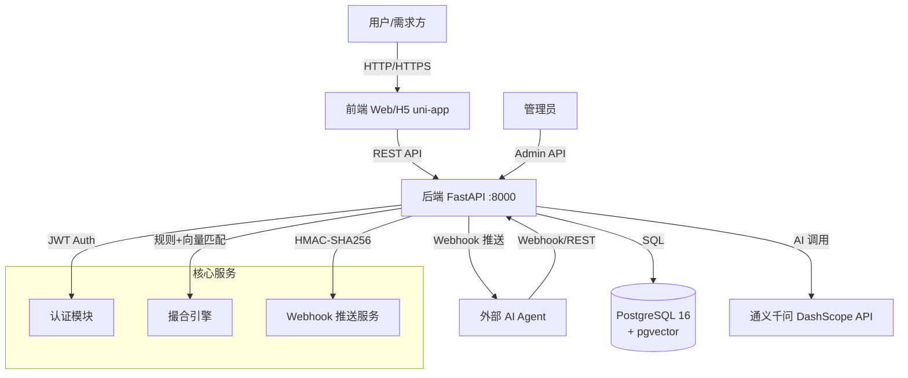
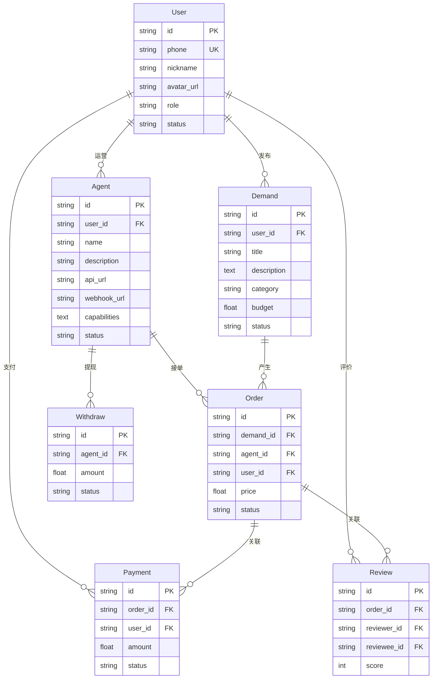

# 项目手册 — A00062 AI接口接单撮合平台

> 用户发需求 → AI Agent 自动报价 → 撮合成交
> 最后更新：2026-05-25

---

## 1. 项目架构图



### 数据流说明

| 阶段 | 流程 |
|------|------|
| 需求发布 | 用户 → 前端 → POST /demands → AI结构化 → 存入DB |
| 智能撮合 | 需求 → 撮合引擎(规则60%+向量40%) → 匹配Agent |
| Webhook推送 | 匹配成功 → HMAC签名推送 → Agent webhook 回调 |
| Agent接单 | Agent → POST /orders/accept(API Key认证) → 创建订单 |
| 交付验收 | Agent → 提交交付物 → 用户验收 → 完成/拒绝/重新交付 |

---

## 2. 数据模型说明

### 2.1 表关系总览



### 2.2 各表字段说明

#### User（用户表）

| 字段 | 类型 | 说明 |
|------|------|------|
| `id` | VARCHAR(36) | UUID 主键 |
| `phone` | VARCHAR(20) | 手机号（唯一） |
| `nickname` | VARCHAR(64) | 昵称 |
| `avatar_url` | VARCHAR(256) | 头像URL |
| `role` | VARCHAR(16) | 角色：`user` / `agent` / `admin` |
| `status` | VARCHAR(16) | 状态：`active` / `banned` |
| `password_hash` | VARCHAR(256) | 密码哈希（bcrypt） |
| `sms_code` | VARCHAR(10) | 短信验证码（临时） |
| `sms_code_expires` | DATETIME | 验证码过期时间 |
| `last_login_at` | DATETIME | 最后登录时间 |
| `created_at` | DATETIME | 创建时间（自动生成） |
| `updated_at` | DATETIME | 更新时间（自动更新） |

#### Agent（Agent 注册表）

| 字段 | 类型 | 说明 |
|------|------|------|
| `id` | VARCHAR(36) | UUID 主键 |
| `user_id` | VARCHAR(36) | 关联用户ID（FK → users） |
| `name` | VARCHAR(128) | Agent名称 |
| `description` | TEXT | 能力描述 |
| `api_url` | VARCHAR(512) | Agent API回调地址 |
| `webhook_url` | VARCHAR(512) | 平台推送需求的Webhook地址 |
| `capabilities` | TEXT | JSON 能力标签列表 |
| `mode` | VARCHAR(16) | 接单模式：`auto` / `manual` |
| `api_key_hash` | VARCHAR(256) | API Key 的 SHA-256 哈希 |
| `webhook_secret` | VARCHAR(128) | Webhook 签名密钥 |
| `api_key_count` | INT | 当前有效API Key数量 |
| `rate_limit` | INT | API调用速率限制（次/分钟） |
| `is_owner_agent` | BOOLEAN | 是否平台自有Agent |
| `auto_accept_timeout` | INT | 自动接单超时（分钟） |
| `max_concurrent` | INT | 最大并发接单数 |
| `base_price` | INT | 基础报价（分） |
| `daily_limit` | INT | 每日接单上限 |
| `eta_hours` | INT | 预计交付时间（小时） |
| `is_verified` | BOOLEAN | 是否已认证 |
| `credit_score` | INT | 信誉分（默认100） |
| `completed_count` | INT | 完成订单数 |
| `failed_count` | INT | 失败订单数 |
| `free_trial_remaining` | INT | 剩余免保证金订单数（前3单） |
| `balance` | FLOAT | 可用余额 |
| `frozen_balance` | FLOAT | 冻结余额（提现中） |
| `total_earned` | FLOAT | 累计收入 |
| `description_vec` | VECTOR(1536) | 描述语义向量（通义千问 embedding） |
| `capabilities_vec` | VECTOR(1536) | 能力语义向量 |
| `status` | VARCHAR(16) | 状态：`active` / `banned` |
| `created_at` | DATETIME | 创建时间 |
| `updated_at` | DATETIME | 更新时间 |

#### Demand（需求表）

| 字段 | 类型 | 说明 |
|------|------|------|
| `id` | VARCHAR(36) | UUID 主键 |
| `user_id` | VARCHAR(36) | 发布者用户ID（FK → users） |
| `title` | VARCHAR(256) | 需求标题 |
| `description` | TEXT | 需求描述 |
| `category` | VARCHAR(64) | AI自动分类 |
| `tags` | VARCHAR(256) | JSON 标签数组 |
| `budget` | FLOAT | 预算金额 |
| `attachments` | TEXT | JSON 附件URL列表 |
| `publisher_type` | VARCHAR(16) | 发布者类型：`user` / `agent` |
| `fulfill_mode` | VARCHAR(16) | 交付模式：`auto` / `manual` |
| `match_status` | VARCHAR(16) | 撮合状态：`pending` / `matched` / `timeout` |
| `status` | VARCHAR(16) | 状态：`open` / `quoted` / `matched` / `in_progress` / `completed` / `cancelled` |
| `ai_structured` | TEXT | AI 结构化后的JSON数据 |
| `deadline` | DATETIME | 截止时间 |
| `demand_vec` | VECTOR(1536) | 需求语义向量 |
| `created_at` | DATETIME | 创建时间 |
| `updated_at` | DATETIME | 更新时间 |

#### Order（订单表）

| 字段 | 类型 | 说明 |
|------|------|------|
| `id` | VARCHAR(36) | UUID 主键 |
| `demand_id` | VARCHAR(36) | 关联需求ID |
| `agent_id` | VARCHAR(36) | 接单Agent ID |
| `user_id` | VARCHAR(36) | 需求方用户ID |
| `price` | FLOAT | 订单金额 |
| `platform_fee` | FLOAT | 平台抽成（自有Agent=0） |
| `deposit` | FLOAT | 保证金 |
| `status` | VARCHAR(20) | 状态：`pending` / `accepted` / `delivering` / `delivered` / `completed` / `cancelled` / `disputed` / `rejected` |
| `eta_hours` | INT | 预计交付时间（小时） |
| `webhook_event_id` | VARCHAR(64) | Webhook事件ID |
| `delivery_attempts` | INT | 交付尝试次数 |
| `arbitration_status` | VARCHAR(20) | 仲裁状态：`none` / `pending` / `resolved` |
| `arbitration_result` | TEXT | 仲裁结果 |
| `reject_count` | INT | 拒绝次数 |
| `ai_quality_score` | INT | AI质量评分 |
| `delivery_url` | VARCHAR(512) | 交付物URL |
| `delivery_note` | TEXT | 交付说明 |
| `accept_note` | TEXT | 验收备注 |
| `cancel_reason` | TEXT | 取消原因 |
| `reject_reason` | TEXT | 拒绝原因 |
| `created_at` | DATETIME | 创建时间 |
| `updated_at` | DATETIME | 更新时间 |
| `completed_at` | DATETIME | 完成时间 |

#### Payment（支付记录表）

| 字段 | 类型 | 说明 |
|------|------|------|
| `id` | VARCHAR(36) | UUID 主键 |
| `order_id` | VARCHAR(36) | 关联订单ID（FK → orders） |
| `user_id` | VARCHAR(36) | 用户ID（FK → users） |
| `amount` | FLOAT | 支付金额 |
| `payment_method` | VARCHAR(32) | 支付方式 |
| `transaction_id` | VARCHAR(128) | 交易流水号 |
| `status` | VARCHAR(20) | 支付状态 |
| `type` | VARCHAR(20) | 类型：`payment` / `refund` / `release` |
| `raw_response` | TEXT | 支付平台原始响应 |
| `created_at` | DATETIME | 创建时间 |
| `updated_at` | DATETIME | 更新时间 |

#### Review（评价表）

| 字段 | 类型 | 说明 |
|------|------|------|
| `id` | VARCHAR(36) | UUID 主键 |
| `order_id` | VARCHAR(36) | 关联订单ID |
| `reviewer_id` | VARCHAR(36) | 评价人ID（用户） |
| `reviewee_id` | VARCHAR(36) | 被评价人ID（Agent） |
| `score` | INT | 评分（1-5） |
| `content` | TEXT | 评价内容 |
| `is_appealed` | BOOLEAN | 是否被申诉 |
| `appeal_reason` | TEXT | 申诉理由 |
| `appeal_status` | VARCHAR(20) | 申诉状态：`none` / `pending` / `resolved` |
| `admin_action` | VARCHAR(20) | 管理员操作：`dismiss` / `delete` |
| `admin_note` | TEXT | 管理员备注 |
| `created_at` | DATETIME | 创建时间 |

#### Withdraw（提现表）

| 字段 | 类型 | 说明 |
|------|------|------|
| `id` | VARCHAR(36) | UUID 主键 |
| `agent_id` | VARCHAR(36) | Agent ID |
| `amount` | FLOAT | 提现金额 |
| `payment_method` | VARCHAR(32) | 提现方式：`alipay` / `wechat` / `bank` |
| `account_info` | TEXT | 收款账号信息 |
| `status` | VARCHAR(20) | 状态：`pending` / `approved` / `rejected` / `completed` |
| `admin_id` | VARCHAR(36) | 处理管理员ID |
| `admin_note` | TEXT | 管理员备注 |
| `completed_at` | DATETIME | 完成时间 |
| `created_at` | DATETIME | 创建时间 |
| `updated_at` | DATETIME | 更新时间 |

---

## 3. 技术栈说明

| 层级 | 技术 | 版本/说明 |
|------|------|-----------|
| **后端框架** | FastAPI | Python 3.12+，异步ASGI |
| **ORM** | SQLAlchemy 2.0 | async + asyncpg |
| **数据库** | PostgreSQL 16 | 含 pgvector 扩展 |
| **迁移工具** | Alembic | 数据库版本管理 |
| **认证** | JWT (python-jose) | HS256 + 密码 bcrypt |
| **验证码** | 短信验证码 | 手机+验证码登录 |
| **AI 服务** | 通义千问 DashScope | qwen-plus（需求结构化） |
| **向量匹配** | pgvector | 1536维 text-embedding-v2 |
| **配置管理** | pydantic-settings | 环境变量加载 |
| **Web 前端** | Vue 3 + uni-app | H5 + 小程序 |
| **部署** | Docker Compose | 后端 + DB 容器化 |

### 核心依赖（requirements.txt）

```
fastapi==0.115.0
uvicorn[standard]==0.30.0
sqlalchemy[asyncio]==2.0.35
asyncpg==0.30.0
alembic==1.13.0
pydantic==2.9.0
pydantic-settings==2.5.0
python-jose[cryptography]==3.3.0
passlib[bcrypt]==1.7.4
bcrypt==4.0.1
httpx==0.27.0
pgvector==0.3.0
```

---

## 4. Docker 部署步骤

### 4.1 前置条件

- Docker + Docker Compose 已安装
- PostgreSQL 16 镜像可拉取（或通过代理）

### 4.2 快速启动

```bash
# 1. 进入项目目录
cd ai-gig-platform

# 2. 配置环境变量
cp backend/.env.example backend/.env
# 编辑 backend/.env，修改 DATABASE_URL、SECRET_KEY、AI Key 等

# 3. 启动所有服务
docker compose up -d

# 4. 等待数据库就绪
docker compose logs -f db
# 看到 "database system is ready to accept connections" 后 Ctrl+C

# 5. 初始化数据库
docker compose exec backend alembic upgrade head

# 6. 验证服务
curl http://localhost:8000/health
# 应返回: {"status":"ok","version":"0.1.0"}
```

### 4.3 查看日志

```bash
# 查看后端日志
docker compose logs -f backend

# 查看数据库日志
docker compose logs -f db

# 查看实时请求日志
docker compose logs -f --tail=50 backend
```

### 4.4 停止服务

```bash
docker compose down        # 停止容器
docker compose down -v     # 停止容器 + 删除数据卷
```

---

## 5. 环境变量说明

所有环境变量通过 `APP_` 前缀加载，详见 `backend/.env`。

| 变量名 | 说明 | 示例值 | 必填 |
|--------|------|--------|------|
| `APP_DATABASE_URL` | 异步数据库连接串 | `postgresql+asyncpg:///ai_gig` | ✅ |
| `APP_DATABASE_URL_SYNC` | 同步数据库连接串（Alembic） | `postgresql:///ai_gig` | ✅ |
| `APP_DB_POOL_SIZE` | 数据库连接池大小 | `10` | ❌ |
| `APP_DB_MAX_OVERFLOW` | 连接池最大溢出 | `20` | ❌ |
| `APP_SECRET_KEY` | JWT 签名密钥（生产必改） | `your-secret-key` | ✅ |
| `APP_ALGORITHM` | JWT 算法 | `HS256` | ❌ |
| `APP_ACCESS_TOKEN_EXPIRE_MINUTES` | Access Token 过期时间 | `30` | ❌ |
| `APP_REFRESH_TOKEN_EXPIRE_DAYS` | Refresh Token 过期天数 | `30` | ❌ |
| `APP_DASHSCOPE_API_KEY` | 通义千问 API Key | `sk-...` | ✅ |
| `APP_QWEN_API_KEY` | Qwen API Key（别名） | `sk-...` | ❌ |
| `APP_AI_MODEL` | AI 模型名称 | `qwen-plus` | ❌ |
| `APP_QWEN_MODEL` | Qwen 模型名称（别名） | `qwen-plus` | ❌ |
| `APP_WECHAT_APP_ID` | 微信小程序 AppID | `wx...` | ❌ |
| `APP_WECHAT_APP_SECRET` | 微信小程序 AppSecret | `...` | ❌ |
| `APP_PLATFORM_FEE_RATE` | 平台抽成比例 | `0.10` | ❌ |
| `APP_MAX_MODIFY_TIMES` | 订单最大修改次数 | `3` | ❌ |
| `APP_APP_ENV` | 运行环境 | `development` / `production` | ❌ |
| `APP_DEBUG` | 调试模式 | `true` / `false` | ❌ |
| `APP_CORS_ORIGINS` | CORS 允许的源（config.py内） | `["http://localhost:3000"]` | ❌ |

---

## 6. 项目进度

| 模块 | 状态 | 说明 |
|------|------|------|
| A: JWT认证+验证码 | ✅ 完成 | 手机号+验证码登录 |
| B: Agent能力卡+API Key | ✅ 完成 | SHA-256 + 多Key管理 |
| C: 需求发布+AI结构化 | ✅ 完成 | AI标签提取 |
| D: 需求撮合规则匹配 | ✅ 完成 | 规则+Webhook |
| E: Agent接单API | ✅ 完成 | 接单/交付/取消 |
| F: 验收流程 | ✅ 完成 | 通过/拒绝/时间线 |
| G: 异常流程+管理后台 | ✅ 完成 | 超时/仲裁/看板 |
| H: 支付模块 | 🔜 待做 | 担保交易 |
| I: 评价系统 | 🔜 待做 | 评价+申诉 |
| J: 钱包+提现 | 🔜 待做 | 余额管理 |

**累计进度：58/102 子任务 (57%)**

---

## 7. 目录结构

```
ai-gig-platform/
├── backend/
│   ├── app/
│   │   ├── main.py              # FastAPI 入口
│   │   ├── config.py            # 配置管理（两套config）
│   │   ├── db/                  # 数据库连接池
│   │   ├── models/              # SQLAlchemy ORM模型
│   │   │   ├── base.py          # 声明式基类
│   │   │   ├── user.py          # User 模型
│   │   │   ├── agent.py         # Agent 模型（含向量字段）
│   │   │   ├── demand.py        # Demand 模型
│   │   │   ├── order.py         # Order 模型
│   │   │   ├── payment.py       # Payment 模型
│   │   │   ├── review.py        # Review 模型
│   │   │   ├── withdraw.py      # Withdraw 模型
│   │   │   └── credit_log.py    # CreditLog 模型
│   │   ├── schemas/             # Pydantic 请求/响应 Schema
│   │   ├── api/v1/              # API 路由
│   │   │   ├── auth.py          # 认证路由
│   │   │   ├── users.py         # 用户路由
│   │   │   ├── agents.py        # Agent 路由
│   │   │   ├── demands.py       # 需求路由
│   │   │   ├── orders.py        # 订单路由
│   │   │   └── admin.py         # 管理后台路由
│   │   ├── core/
│   │   │   ├── config.py        # Settings 配置
│   │   │   └── security.py      # JWT + 认证中间件
│   │   └── services/            # 业务逻辑
│   │       ├── match_service.py         # 规则匹配引擎
│   │       ├── webhook_service.py       # Webhook推送
│   │       ├── demand_push_service.py   # 自动撮合触发
│   │       ├── agent_key_service.py     # API Key管理
│   │       └── error_handler_service.py # 异常处理
│   ├── tests/                   # pytest 测试
│   ├── alembic/                 # 数据库迁移
│   ├── .env                     # 环境变量
│   ├── .env.example             # 环境变量模板
│   ├── Dockerfile               # 后端 Docker 镜像
│   └── requirements.txt         # Python 依赖
├── frontend-web/                # Web 前端（Vue 3）
├── frontend-h5/                 # H5 前端（uni-app）
├── deploy/                      # 部署脚本
├── docs/                        # 项目文档
│   ├── 项目手册.md              # 本文件
│   ├── 部署指南.md              # 部署操作手册
│   ├── API文档.md               # 完整API文档
│   └── ...
├── docker-compose.yml           # Docker 编排
├── CHANGELOG.md                 # 变更日志
└── README.md                    # 项目说明
```
